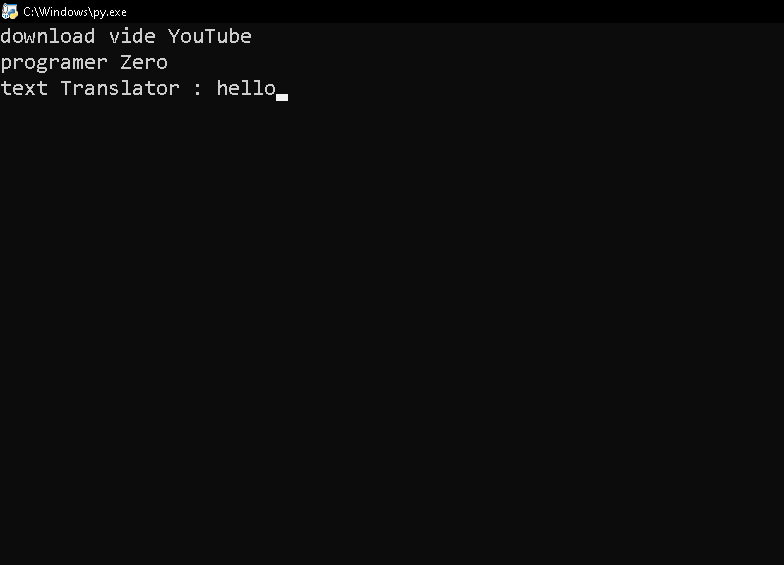

# Translat

 
 
 
.It is a tool for translating speech from the Arabic language into the English language. It was made using the Python language

## Program Advantages
- features :
   * [X] Supports the Arabic language
   * [X] Translation from Arabic into English
   * [X] immediate translation
   * [ ] Support other languages
